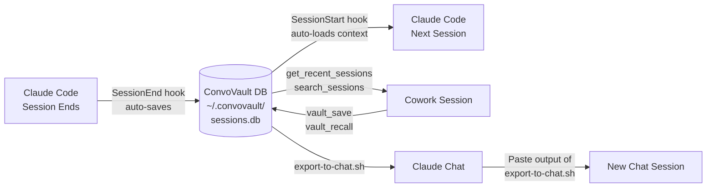

# ConvoVault

> Cross-surface persistent memory for Claude sessions. Vault your conversations from Code, Cowork, and Chat -- recall decisions, artifacts, and context in any future session. Never re-explain yourself again.

**By [Labyrinth Analytics Consulting](https://labyrinthanalyticsconsulting.com)**

---

## Quick Install

**Requires [uv](https://docs.astral.sh/uv/getting-started/installation/) -- a fast Python package manager.**

```bash
# Install uv (one time, if you don't have it)
curl -LsSf https://astral.sh/uv/install.sh | sh

# Install via the Labyrinth Analytics marketplace
/plugin install convovault@labyrinth-analytics-claude-plugins
```

Or add directly as an MCP server in Claude Code's `.claude/settings.json`:

```json
{
  "mcpServers": {
    "convovault": {
      "command": "uvx",
      "args": ["convovault"]
    }
  }
}
```

---

## The Problem

Claude users who work across Code, Cowork, and Chat lose all context every time they switch tools or start a new session. You end up re-explaining your project architecture, re-describing your tech stack, re-litigating decisions you made two weeks ago.

ConvoVault fixes this.

---

## How It Works Across Surfaces



**Claude Code (fully automatic):** A SessionEnd hook saves your session when you close it. A SessionStart hook loads relevant context when you open a new one. Zero clicks required.

**Cowork:** Use MCP tools directly -- ask Claude to recall what you discussed last time, search for a past decision, or save the current session to the vault.

**Chat (web):** No plugin support, but the included `export-to-chat.sh` script exports a session summary you can paste into a new Chat conversation to bridge context.

---

## What Gets Saved

Each session record captures:

- **Decisions** -- Key choices made during the session
- **Artifacts** -- Files created or modified
- **Open questions** -- Things left unresolved for next time
- **Narrative summary** -- A 2-3 paragraph overview of what happened
- **Tags and persona** -- For filtering and agent-specific memory

---

## MCP Tools Reference

| Tool | What it does |
|---|---|
| `save_session` | Save the current session with decisions, artifacts, and questions |
| `get_recent_sessions` | List sessions from the last N days |
| `get_session` | Get full detail for a specific session |
| `search_sessions` | Full-text search across all session summaries |
| `get_context_for` | Return relevant fragments for a given topic |
| `get_sessions_by_tag` | Filter sessions by tag |
| `get_sessions_by_persona` | Filter by persona (for AI agent use cases) |
| `update_session` | Update an existing session record |
| `delete_session` | Remove a session |
| `list_personas` | List all personas in the vault |
| `get_stats` | Summary statistics about your vault |
| `vault_suggest` | Proactive suggestions -- what to revisit based on open questions |

---

## Supported Platforms

| Platform | Support | Notes |
|---|---|---|
| **Claude Code** | Full | SessionEnd/SessionStart hooks run automatically |
| **Cowork** | Full | MCP tools available; vault_save and vault_recall work end-to-end |
| **Chat (web)** | Partial | No plugin support; use `export-to-chat.sh` to bridge context |

---

## Free vs Pro

| Feature | Free | Pro ($8/mo) |
|---|---|---|
| Sessions stored | Last 50 | Unlimited |
| Search history | 7 days | All time |
| Personas | 1 | Unlimited |
| Projects | 3 | Unlimited |
| Export formats | Markdown | Markdown + JSON |

Pro upgrade: [labyrinthanalyticsconsulting.com](https://labyrinthanalyticsconsulting.com)

---

## Companion Product

**[ProjectVault](https://github.com/labyrinth-analytics/projectvault)** -- Searchable, structured knowledge base for your AI projects. Where ConvoVault remembers *conversations*, ProjectVault stores *documents* -- specs, configs, guides, and reference material. They work well together.

---

## Data and Privacy

ConvoVault is **local-first**. All data lives in `~/.convovault/sessions.db` on your machine. Nothing is sent to any external server. You own your data.

---

## Issues and Feedback

[github.com/labyrinth-analytics/convovault/issues](https://github.com/labyrinth-analytics/convovault/issues)
